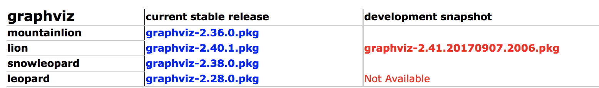
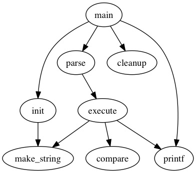
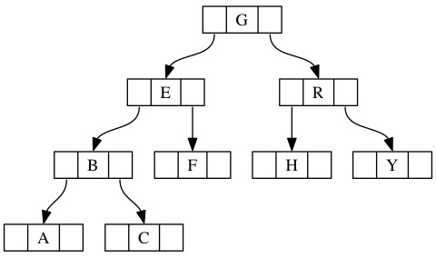
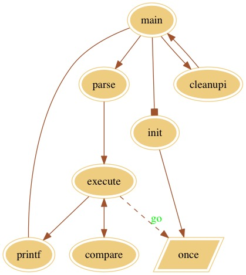
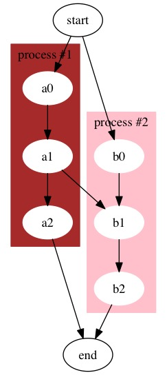

---

layout: post # 使用的布局（不需要改）

title: GraphViz使用简介及在Java工程中调用 # 标题 

subtitle: GraphViz初步入门 #副标题

date: 2017-09-16 # 时间

author: holynova-SD # 作者

header-img: img/post-bg-2015.jpg #这篇文章标题背景图片

catalog: true # 是否归档

tags: #标签

 - GraphViz

 - Java

 - Software Engineering

---

# GraphViz简介及应用

Graphviz是贝尔实验室研制的一款开源的画图工具，其输入为一个用dot语言编写的脚本，通过对输入脚本的分析，分析出其中的点、边和子图，然后根据其属性绘制为一幅图。编写dot脚本时，我们只需考虑点和边之间的关系，至于布局则完全不需要我们考虑。GraphViz支持生成jpg、png、bmp、ps、svg以及pdf等格式的图片，使用起来简单强大。

GraphViz官方网站：[http://www.graphviz.org](http://www.graphviz.org)

## GraphViz下载及安装

### Windows系统下

Windows系统下GraphViz下载地址为：[Windows下载地址](http://www.graphviz.org/Download_windows.php)


选择相应文件下载安装后需将graphviz安装目录下的bin文件夹添加到Path环境变量中。之后在cmd中输入
```
dot -version
```
如果正确显示版本号等信息则说明安装成功。

### Mac OS系统下

Mac OS系统下GraphViz下载地址为：[MacOS下载地址](http://www.graphviz.org/Download_macos.php)



选择相应文件安装即可。下载完成后可运行程序dot的路径一般为 /usr/local/bin/dot 。在终端中输入
```
dot -version
```
如果正确显示版本号等信息则说明安装成功。

## GraphViz简单使用

### GraphViz程序中使用

直接运行程序，并打开相应.dot或.gv文件，可在窗口中看到生成图，这里不再赘述。

### 在终端中调用

GraphViz编译命令为
```
dot -Ttype filename1 -o filename2
```
或
```
dot filename1 -Ttype -o filename2
```
其中filename1和filename2均为带路径的文件全名，filename1为.dot或.gv文件，type为生成图片的格式。

下面看一些官方文档的例子：

在某文件夹下创建文本文档，编辑以下内容：

```
digraph G {
    main -> parse -> execute;
    main -> init;
    main -> cleanup;
    execute -> make_string;
    execute -> printf
    init -> make_string;
    main -> printf;
    execute -> compare;
}
```

并保存为.dot文件或.gv文件（这里以.gv文件举例，保存为test.gv，生成图片以.jpg格式举例）。

在终端cd进该文件夹，之后输入
```
dot -Tjpg test.gv -o test.jpg
```
可以看到在当前文件夹下生成了test.jpg，图片如下：



编辑test.gv为以下内容：

```
digraph g {
    node [shape = record,height=.1];
    node0[label = "<f0> |<f1> G|<f2> "];
    node1[label = "<f0> |<f1> E|<f2> "];
    node2[label = "<f0> |<f1> B|<f2> "];
    node3[label = "<f0> |<f1> F|<f2> "];
    node4[label = "<f0> |<f1> R|<f2> "];
    node5[label = "<f0> |<f1> H|<f2> "];
    node6[label = "<f0> |<f1> Y|<f2> "];
    node7[label = "<f0> |<f1> A|<f2> "];
    node8[label = "<f0> |<f1> C|<f2> "];
    "node0":f2 -> "node4":f1;
    "node0":f0 -> "node1":f1;
    "node1":f0 -> "node2":f1;
    "node1":f2 -> "node3":f1;
    "node2":f2 -> "node8":f1;
    "node2":f0 -> "node7":f1;
    "node4":f2 -> "node6":f1;
    "node4":f0 -> "node5":f1;
}

```

终端进行相同操作，可以得到下面的图片：



编辑test.gv为以下内容：

```
digraph G {
    node [peripheries=2 style=filled color="#eecc80"]
    edge [color="sienna" fontcolor="green"]
    main -> parse -> execute;
    main -> init [arrowhead = box];
    main -> cleanupi -> main;
    make_string[label = once shape=parallelogram style=filled ]
    execute -> make_string[label=go style=dashed arrowtail=diamond];
    execute -> printf [shape=box];
    init -> make_string;
    main -> printf[dir=none];
    execute -> compare[dir=both];
}

```

终端进行相同操作，可以得到下面的图片：



## dot语法简介

### 注释

dot语法使用使用双斜杠注释。

### 全局性质

在dot语法中，对于所有字符串，除了多语句节点都应该加上双引号。如果是单个单词（即中间没有空格）就可以不加。

字符串当中可以加上\\n换行符。

每一个[ ]括号内都可以写多个相同类型的句子并列，即[语句，语句，语句]，如：a[fontname = Verdana, color=navy, shape=record, height=.1];

### 全局设置

#### 设置整张图的大小：
```
 size="数字,数字";
```
如 
```
size="2,2"; 
```
单位为英寸，此语句可放在函数的任意位置。

#### 设置整张图的label：

##### 内容
```
label="显示在图上的内容";
```
##### label竖直方向上的位置
```
labelloc=参数值;
```
参数值有b（bottom）和t（top）。如果不设置的话，默认为bottom。

##### label水平方向上的位置
```
labeljust=参数值;
```
参数值有l（left）和r（right），其他任意值代表middle。如果不设置的话，默认middle。

#### 设置整张图的节点属性
```
 node[节点的设置语句];
```
如
```
 node [fontname = Verdana, color=navy, shape=record, height=.1];
```
辖域是这句话之后构建的所有节点。

优先级按出现顺序来决定，后出现的优先级比先出现的高，也就是说可以被新的同属性语句覆盖。

#### 设置整张图的边属性
```
 edge [边的属性设置语句];
```
如
```
 edge [color=red,style=dotted];
```
辖域是这句话之后构建的所有的边。

优先级按出现顺序来决定，后出现的优先级比先出现的高，也就是说可以被新的同属性语句覆盖。

### 函数

dot主函数有两种，有向图和无向图。

有向图（使用-\>表述节点之间的关系）：

```
digraph my_name（图的名字，自己命名）  
{  
    ……  
}

```

无向图（使用--表述节点之间的关系）：

```
graph my_name（图的名字，自己命名）  
{  
    ……  
}

```

定义好主图之后，在主图中还可以定义子图，如：

```
digraph G {
    subgraph cluster_0 {

    }
    subgraph cluster_1 {

    }
    ......
}

```

举个例子，以下内容：

```
digraph g {     
    subgraph cluster0 {
         node[style=filled, color=white];
         style=filled;
         color=brown;
         a0->a1->a2;
         label="process #1";
      }

    subgraph cluster1 {
       node[style=filled, color=white];
       style=filled;
       color=pink;
       b0->b1->b2;
       label="process #2";
       labelColor=white;
    }

     start->a0;
     start->b0;
     a1->b1;
     a2->end;
     b2->end;
 }

```

将得到以下图片：



### 单独设置节点属性

#### 设置节点的框的形状
```
 节点文字内容[shape=框的风格名称];
```
例如：
```
 a[shape=box];
```
默认形状是椭圆。如果是 plaintext 就只有文字，没有边框。

#### 设置节点框的大小
```
 节点文字内容[width=值,height=值];
```
例如:
```
 a[width=.1,height=2.5]; 
```
单位为英寸。

#### 设置节点边框的颜色
```
 节点文字内容[color=颜色名称];
```
例如：
```
 a[color=red];
```
默认颜色为黑色。

#### 设置节点填充

默认不填充。
```
 节点文字内容[style=filled];
```
填充颜色与设置的边框颜色相同，没有设置边框颜色就默认用灰色填充。

#### 设置多边形框的多边形边数

对节点的形状来说，除了shape=record（矩形）和Mrecord（圆角矩形）的边数已经定了，还有circle那些曲边的形状以外，其他的多边形（polygon）可以设置多边形边数。如下：
```
 节点文字内容[sides=边数];
```
例如
```
 a[sides=5];
```
节点a的边框就是五边形。

#### 设置节点边框的层数
```
 节点文字内容[peripheries=层数];
```
例如：
```
 a[peripheries=3];
```
效果就是有3条边缘线。

#### 重命名节点的文字内容
```
 原节点文字内容[label=新节点文字内容];
```
只能重命名节点的文字内容，不能重命名边上标签的内容。

#### 节点内多语句（shape=record和Mrecord时）
```
 节点名[label="<地址名>内容|<地址名> 内容|<地址名> 内容"];
```
节点名不会显示出来（因为框内要显示多语句），比如：
```
 a[shape=record,label="<f0>one|<f1>two|<f2> three"]; 
```
显示出来就是有一个1 * 3的方框格，从左到右里面的内容是one，two，three。另外，内容可以是一个空格（不写或者写多个空格显示出来都是一个空格子）。

#### 注意

节点的设置和边的构造不能同时进行，比如 a[color=red]->b; 是不可以的。

### 构造边

以下以有向图为例，无向图只需替换节点连接符号

#### 一对一
```
 节点文字内容 ->节点文字内容;
```
例如
```
 a->b;
```
#### 一对多
```
 { 节点文字内容 ; 节点文字内容 ; 节点文字内容 }->节点文字内容;
```
例如：
```
 {b;c;d}->a;
```
#### 多对多
```
 { 节点文字内容 ; 节点文字内容 ; 节点文字内容 }->{ 节点文字内容 ; 节点文字内容 ; 节点文字内容 } ; 
```
例如：
```
 {m,n,p,q}->{b;c;d};
```
此时会有4 * 3 = 12条边，左右两个集合内任意两点之间有一条边。

#### 连续边
```
 节点文字内容 ->节点文字内容->节点文字内容->节点文字内容;
```
例如：
```
 a->b->c;
```
就会显示从a到b有一条边，从b到c有一条边。

### 单独设置边属性

#### 设置边的风格
```
 节点文字内容->节点文字内容[style=风格名称]; 
```
例如：
```
 a->b[style=dotted]; 
```
会画出一条从a到b的有向虚线段。

#### 设置边的颜色
```
 节点文字内容->节点文字内容[color=颜色名称]; 
```
例如：
```
 a->b[color=red];
```
#### 设置边的标签
```
 节点文字内容->节点文字内容[label="想在边上显示的文字"]; 
```
例如：
```
 a->b[label="This is a label"]; 
```
### 点和边属性可取值

点和边的属性可取值具体可从[GraphViz官网](http://www.graphviz.org) 官方文档了解。这里不再赘述。

# 在Java项目中调用GraphViz的一种方法

>有时候需要在Java项目中调用GraphViz，已经有人专门为此写好了一个类，只需将此类加入项目即可。（首先要确保计算机中已安装GraphViz软件）

## 注意

以下类中第51行的TEMP_DIR是临时生成文件的路径，尽量确保该路径下的文件可以进行读写以及新建删除操作。

TEMP\_DIR由在第73行的setdir函数确定，如果不想每次调用都设立路径可以直接将该函数注释并将TEMP\_DIR设定为一固定路径。

代码如下：

```
package textGraph;
import java.io.BufferedReader;
import java.io.DataInputStream;
import java.io.File;
import java.io.FileInputStream;
import java.io.FileOutputStream;
import java.io.FileWriter;
import java.io.InputStreamReader;

/**
* <dl>
* <dt>Purpose: GraphViz Java API
* <dd>
*
* <dt>Description:
* <dd> With this Java class you can simply call dot
*      from your Java programs.
* <dt>Example usage:
* <dd>
* <pre>
*    GraphViz gv = new GraphViz();
*    gv.setdir(".../.../.../");
*    gv.addln(gv.start_graph());
*    gv.addln("A -> B;");
*    gv.addln("A -> C;");
*    gv.addln(gv.end_graph());
*    System.out.println(gv.getDotSource());
*
*    String type = "gif";
*    File out = new File("out." + type);   // out.gif in this example
*    gv.writeGraphToFile( gv.getGraph( gv.getDotSource(), type ), out );
* </pre>
* </dd>
*
* </dl>
*
* @version v0.5.1, 2013/03/18 (March) -- Patch of Juan Hoyos (Mac support)
* @version v0.5, 2012/04/24 (April) -- Patch of Abdur Rahman (OS detection + start subgraph + 
* read config file)
* @version v0.4, 2011/02/05 (February) -- Patch of Keheliya Gallaba is added. Now you
* can specify the type of the output file: gif, dot, fig, pdf, ps, svg, png, etc.
* @version v0.3, 2010/11/29 (November) -- Windows support + ability to read the graph from a text file
* @version v0.2, 2010/07/22 (July) -- bug fix
* @version v0.1, 2003/12/04 (December) -- first release
* @author  Laszlo Szathmary (<a href="jabba.laci@gmail.com">jabba.laci@gmail.com</a>)
*/
public class GraphViz {
    /**
     * The dir. where temporary files will be created.
     */
    private static String TEMP_DIR ;

    /**
     * Where is your dot program located? It will be called externally.
     */
    private static String DOT = "/usr/local/bin/dot";

    /**
     * The image size in dpi. 96 dpi is normal size. Higher values are 10% higher each.
     * Lower values 10% lower each.
     * 
     * dpi patch by Peter Mueller
     */
    private int[] dpiSizes = {46, 51, 57, 63, 70, 78, 86, 96, 106, 116, 128, 141, 155, 170, 187, 206, 226, 249};

    /**
     * Define the index in the image size array.
     */
    private int currentDpiPos = 15;
    /**
     * set the dir. where temporary files will be created.
     */
    public void setdir(String path) {
	    TEMP_DIR = path;
    }
    /**
     * Increase the image size (dpi).
     */
    public void increaseDpi() {
        if ( this.currentDpiPos < (this.dpiSizes.length - 1) ) {
            ++this.currentDpiPos;
        }
    }

    /**
     * Decrease the image size (dpi).
     */
    public void decreaseDpi() {
        if (this.currentDpiPos > 0) {
            --this.currentDpiPos;
        }
    }

    public int getImageDpi() {
        return this.dpiSizes[this.currentDpiPos];
    }

    /**
     * The source of the graph written in dot language.
     */
    private StringBuilder graph = new StringBuilder();

    /**
     * Constructor: creates a new GraphViz object that will contain
     * a graph.
     */
    public GraphViz() {
    }

    /**
     * Returns the graph's source description in dot language.
     * @return Source of the graph in dot language.
     */
    public String getDotSource() {
        return this.graph.toString();
    }

    /**
     * Adds a string to the graph's source (without newline).
     */
    public void add(String line) {
        this.graph.append(line);
    }

    /**
     * Adds a string to the graph's source (with newline).
     */
    public void addln(String line) {
        this.graph.append(line + "\n");
    }

    /**
     * Adds a newline to the graph's source.
     */
    public void addln() {
        this.graph.append('\n');
    }

    public void clearGraph(){
        this.graph = new StringBuilder();
    }

    /**
     * Returns the graph as an image in binary format.
     * @param dot_source Source of the graph to be drawn.
     * @param type Type of the output image to be produced, e.g.: gif, dot, fig, pdf, ps, svg, png.
     * @return A byte array containing the image of the graph.
     */
    public byte[] getGraph(String dot_source, String type)
    {
        File dot;
        byte[] img_stream = null;
        try {
            dot = writeDotSourceToFile(dot_source);
            if (dot != null)
            {
                img_stream = get_img_stream(dot, type);
                if (dot.delete() == false) 
                    System.err.println("Warning: " + dot.getAbsolutePath() + " could not be deleted!");
                return img_stream;
            }
            return null;
        } catch (java.io.IOException ioe) { return null; }
    }

    /**
     * Writes the graph's image in a file.
     * @param img   A byte array containing the image of the graph.
     * @param file  Name of the file to where we want to write.
     * @return Success: 1, Failure: -1
     */
    public int writeGraphToFile(byte[] img, String file)
    {
        File to = new File(file);
        return writeGraphToFile(img, to);
    }

    /**
     * Writes the graph's image in a file.
     * @param img   A byte array containing the image of the graph.
     * @param to    A File object to where we want to write.
     * @return Success: 1, Failure: -1
     */
    public int writeGraphToFile(byte[] img, File to)
    {
        try {
            FileOutputStream fos = new FileOutputStream(to);
            fos.write(img);
            fos.close();
        } catch (java.io.IOException ioe) { return -1; }
        return 1;
    }

    /**
     * It will call the external dot program, and return the image in
     * binary format.
     * @param dot Source of the graph (in dot language).
     * @param type Type of the output image to be produced, e.g.: gif, dot, fig, pdf, ps, svg, png.
     * @return The image of the graph in .gif format.
     */
    private byte[] get_img_stream(File dot, String type)
    {
        File img;
        byte[] img_stream = null;

        try {
            img = File.createTempFile("graph_", "."+type, new File(GraphViz.TEMP_DIR));
            Runtime rt = Runtime.getRuntime();

            String[] args = {DOT, "-T"+type, "-Gdpi="+dpiSizes[this.currentDpiPos], dot.getAbsolutePath(), "-o", img.getAbsolutePath()};
            Process p = rt.exec(args);

            p.waitFor();

            FileInputStream in = new FileInputStream(img.getAbsolutePath());
            img_stream = new byte[in.available()];
            in.read(img_stream);
            // Close it if we need to
            if( in != null ) in.close();

            if (img.delete() == false) 
                System.err.println("Warning: " + img.getAbsolutePath() + " could not be deleted!");
        }
        catch (java.io.IOException ioe) {
            System.err.println("Error:    in I/O processing of tempfile in dir " + GraphViz.TEMP_DIR+"\n");
            System.err.println("       or in calling external command");
            ioe.printStackTrace();
        }
        catch (java.lang.InterruptedException ie) {
            System.err.println("Error: the execution of the external program was interrupted");
            ie.printStackTrace();
        }

        return img_stream;
    }

    /**
     * Writes the source of the graph in a file, and returns the written file
     * as a File object.
     * @param str Source of the graph (in dot language).
     * @return The file (as a File object) that contains the source of the graph.
     */
    public File writeDotSourceToFile(String str) throws java.io.IOException
    {
        File temp;
        try {
            temp = File.createTempFile("dorrr",".dot", new File(GraphViz.TEMP_DIR));
            FileWriter fout = new FileWriter(temp);
            fout.write(str);
                       //BufferedWriter br=new BufferedWriter(new FileWriter("dotsource.dot"));
                       //br.write(str);
                       //br.flush();
                       //br.close();
            fout.close();
        }
        catch (Exception e) {
            System.err.println("Error: I/O error while writing the dot source to temp file!");
            return null;
        }
        return temp;
    }

    /**
     * Returns a string that is used to start a graph.
     * @return A string to open a graph.
     */
    public String start_graph() {
        return "digraph G {";
    }

    /**
     * Returns a string that is used to end a graph.
     * @return A string to close a graph.
     */
    public String end_graph() {
        return "}";
    }

    /**
     * Takes the cluster or subgraph id as input parameter and returns a string
     * that is used to start a subgraph.
     * @return A string to open a subgraph.
     */
    public String start_subgraph(int clusterid) {
        return "subgraph cluster_" + clusterid + " {";
    }

    /**
     * Returns a string that is used to end a graph.
     * @return A string to close a graph.
     */
    public String end_subgraph() {
        return "}";
    }

    /**
     * Read a DOT graph from a text file.
     * 
     * @param input Input text file containing the DOT graph
     * source.
     */
    public void readSource(String input)
    {
        StringBuilder sb = new StringBuilder();

        try
        {
            FileInputStream fis = new FileInputStream(input);
            DataInputStream dis = new DataInputStream(fis);
            BufferedReader br = new BufferedReader(new InputStreamReader(dis));
            String line;
            while ((line = br.readLine()) != null) {
                sb.append(line);
            }
            dis.close();
        } 
        catch (Exception e) {
            System.err.println("Error: " + e.getMessage());
        }

        this.graph = sb;
    }
}

```